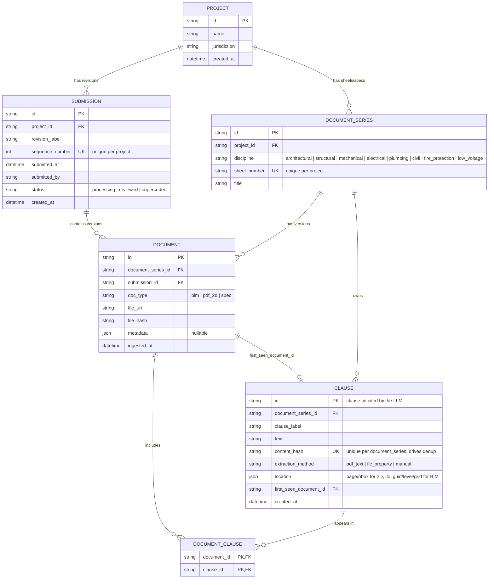

# Document/Clause Storage — Entity Relationship Diagram

Reflects [app/models.py](../app/models.py). Source of truth is the code —
regenerate this by hand if the models change.

## Reading this diagram

- **`PROJECT → SUBMISSION`**: one project has many revision events ("Rev A",
  "Rev B", ...).
- **`DOCUMENT_SERIES`**: the logical identity of a sheet (e.g. "S-201") that
  persists across revisions. `DOCUMENT` rows are the actual versioned files;
  `DOCUMENT_SERIES` is what lets you ask "give me every version of S-201."
- **`CLAUSE` is not owned by one `DOCUMENT`** — it's owned by the
  `DOCUMENT_SERIES`, and linked to whichever document version(s) it appears
  in via `DOCUMENT_CLAUSE`. That's the dedup design: if a clause's
  `content_hash` is unchanged between Rev A and Rev B, no new `CLAUSE` row is
  created — the existing row just gets a second `DOCUMENT_CLAUSE` entry
  pointing at the Rev B document. This is what makes revision diffing
  (added/removed/unchanged clauses) and incremental re-check derivable
  directly from the schema, without a separate diff/lineage table.
- **`first_seen_document_id`** on `CLAUSE` is provenance only — which
  document version *introduced* this exact content — not the set of
  documents it currently appears in (that's `DOCUMENT_CLAUSE`'s job).

## Not yet built

`flags` (conflict-detection output) and `flag_citations` will reference
`CLAUSE.id` directly once conflict detection is persisted — not shown here
since it doesn't exist in the code yet.
