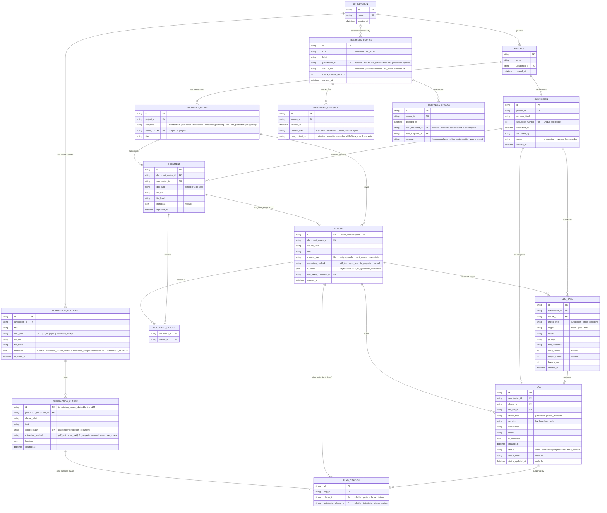

# Document/Clause Storage — Entity Relationship Diagram

Reflects [app/models.py](../app/models.py). Source of truth is the code —
regenerate this by hand if the models change. See [WORKFLOW.md](WORKFLOW.md)
for the *process* this schema supports (ingest → retrieve → reason → trace →
continuous re-check), not just the entities.

## Reading this diagram

- **`PROJECT → SUBMISSION`**: one project has many revision events ("Rev A",
  "Rev B", ...).
- **`DOCUMENT_SERIES`**: the logical identity of a sheet (e.g. "S-201") that
  persists across revisions. `DOCUMENT` rows are the actual versioned files;
  `DOCUMENT_SERIES` is what lets you ask "give me every version of S-201."
- **`CLAUSE` is not owned by one `DOCUMENT`** — it's owned by the
  `DOCUMENT_SERIES`, and linked to whichever document version(s) it appears
  in via `DOCUMENT_CLAUSE`. That's the dedup design: if a clause's
  `content_hash` is unchanged between Rev A and Rev B, no new `CLAUSE` row is
  created — the existing row just gets a second `DOCUMENT_CLAUSE` entry
  pointing at the Rev B document. This is what makes revision diffing
  (added/removed/unchanged clauses) and incremental re-check derivable
  directly from the schema, without a separate diff/lineage table.
- **`first_seen_document_id`** on `CLAUSE` is provenance only — which
  document version *introduced* this exact content — not the set of
  documents it currently appears in (that's `DOCUMENT_CLAUSE`'s job).
- **`JURISDICTION → JURISDICTION_DOCUMENT → JURISDICTION_CLAUSE`** is a
  separate, lighter-weight parallel chain for jurisdiction code reference
  material — no revision-tracking or cross-document dedup (yet), each
  jurisdiction document is ingested once, standalone. A `PROJECT` belongs to
  exactly one `JURISDICTION`.
- **`LLM_CALL`** is the audit record of one reasoning-engine invocation
  (prompt/raw response/tokens/latency), logged for every clause actually
  reasoned over — including ones that produced zero flags, since "why didn't
  this get flagged" is as much an audit question as "why did this get
  flagged." A `FLAG` always traces back to exactly one `LLM_CALL` via
  `llm_call_id`, so "what did the model see" is always answerable.
- **`check_type`** on both `LLM_CALL` and `FLAG` distinguishes the two check
  families (jurisdiction-compliance vs. cross-discipline coordination). Both
  families write rows scoped to `submission_id`, filtered by `check_type` so
  running one check can never touch the other's results.
- **Checks are incremental by default** (`app/check_persistence.py`): since
  `CLAUSE` rows are immutable and content-hash deduped, a clause only ever
  needs reasoning once per `check_type`, ever — a re-check skips any clause
  that already has an `LLM_CALL` of that type from *any* of the project's
  submissions, and only reasons about genuinely new/changed clauses. This is
  why "current flags for a project" is a computed view (every `FLAG` whose
  `clause_id` is still part of the project's current clause set), not a
  `submission_id` filter — a flag from an older submission stays "current"
  until the clause it's about is itself superseded. An explicit `force=True`
  clears a check_type's Flag/LLMCall rows project-wide and redoes everything.
- **`FLAG_CITATION`** has exactly one of `clause_id` / `jurisdiction_clause_id`
  set per row, matching `check_type`: jurisdiction checks cite
  `JURISDICTION_CLAUSE` rows, cross-discipline checks cite another project
  `CLAUSE` (both built — see `app/conflict_detection.py` and
  `app/cross_discipline_detection.py`).
- **`FLAG.status`** is a reviewer's disposition (open/acknowledged/resolved/
  false_positive), independent of `severity` (the model's own confidence
  label). Defaults to `open` on every flag; a reviewer sets it via the flags
  page, which also rolls it up into the reviewer-confirmed precision figure
  on `/metrics`. This is the "pilot alongside human review" hook — it lets a
  reviewer record what the tool got right or wrong without a separate system
  comparing against an independent review pass.
- **`FRESHNESS_SOURCE → FRESHNESS_SNAPSHOT/FRESHNESS_CHANGE`** is a separate
  chain feeding the jurisdiction-code-freshness POC
  (`app/freshness/*`), scheduled independently of any submission - every
  fetch writes a `FRESHNESS_SNAPSHOT` (for audit, even when nothing changed);
  a `FRESHNESS_CHANGE` row is written only when a fetch's content hash
  differs from the source's previous snapshot. `FRESHNESS_SOURCE.jurisdiction_id`
  is nullable because `icc_public` sources (base model code editions) apply
  across every jurisdiction, not one in particular - only `municode` sources
  are tied to a specific `JURISDICTION`.
- **A `municode`-kind `FRESHNESS_SOURCE`'s content also feeds
  `JURISDICTION_CLAUSE`** (`app/freshness/jurisdiction_sync.py`), not just the
  freshness dashboard: each scraped section becomes a `JURISDICTION_CLAUSE`
  row (`extraction_method = municode_scrape`) under a synthetic
  `JURISDICTION_DOCUMENT` (`doc_type = municode_scrape`), so it's picked up by
  the same retrieval pool (`find_candidate_jurisdiction_clauses`) as a
  human-uploaded document. That link is `JURISDICTION_DOCUMENT.metadata_
  ->> freshness_source_id`, not a real foreign key (no schema migration
  tooling exists yet to add one to an already-populated table), so it isn't
  drawn as a formal relationship above. Retrieval prefers whichever of an
  uploaded vs. scraped clause was more recently confirmed current on a
  near-tied match, via `JURISDICTION_DOCUMENT.ingested_at` - not "uploaded
  always wins," since a stale upload shouldn't outrank a same-day scrape.
