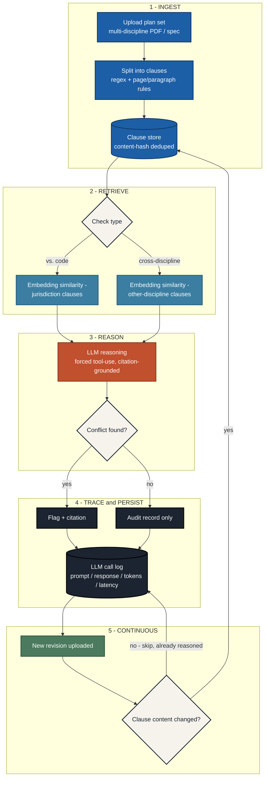

# Backend Workflow

Companion to [ERD.md](ERD.md) (the data model) — this is the *process* a
submission goes through, end to end. Five stages, with an explicit loop back
into stage 1 on a new revision.

## Stage notes

1. **Ingest** — a plan set is split into clauses, not fixed-token chunks (see
   ERD.md's `CLAUSE` notes): the retrieval unit is driven by what a citation
   needs to reference, not by convenience. Table noise is redacted before
   splitting (`app/clause_extraction.py`).
2. **Retrieve** — a local sentence-embedding model (`all-MiniLM-L6-v2`, see
   `app/retrieval.py`) narrows candidates before the LLM runs, so the LLM
   never has to compare every clause against every other clause (O(n²)).
   Which candidate pool it searches depends on check type: jurisdiction code
   clauses (`find_candidate_jurisdiction_clauses`) or other-discipline
   project clauses in the same submission
   (`find_candidate_cross_discipline_clauses`).
3. **Reason** — forced tool-use constrains the model to a JSON schema so it
   can only cite clause IDs it was actually shown (`app/llm.py`,
   `app/llm_groq.py`; `app/llm_mock.py` is a labeled placeholder, never
   mistaken for real reasoning). Citations to anything outside what was
   shown are dropped before persistence, as defense in depth.
4. **Trace & persist** — every clause actually reasoned over gets an
   `LLM_CALL` row, whether or not it produced a flag (`app/check_persistence.py`).
   A `Flag` always traces back to exactly one `LLM_CALL`. A flag also carries
   a reviewer disposition (`Flag.status` - open/acknowledged/resolved/false
   positive, set from the flags page), independent of this pipeline; see
   ERD.md.
5. **Continuous** — `Clause` rows are immutable and content-hash deduped, so
   a clause only ever needs reasoning once per check type, ever. A new
   revision only triggers reasoning on genuinely new/changed clauses
   (incremental by default; `force=True` clears and redoes everything).
   Revision diffing (`diff_between_submissions`) and audit export
   (`/projects/<id>/audit-report`, `.csv`) both build on this same
   content-hash identity.

## Presentation version

A styled, presentation-ready version of this diagram (with stage
walkthroughs, the two-check-type comparison, and the trust/traceability
callouts) is published as a standalone page for demo use - ask before
regenerating, since it's hand-designed rather than derived from this file.
