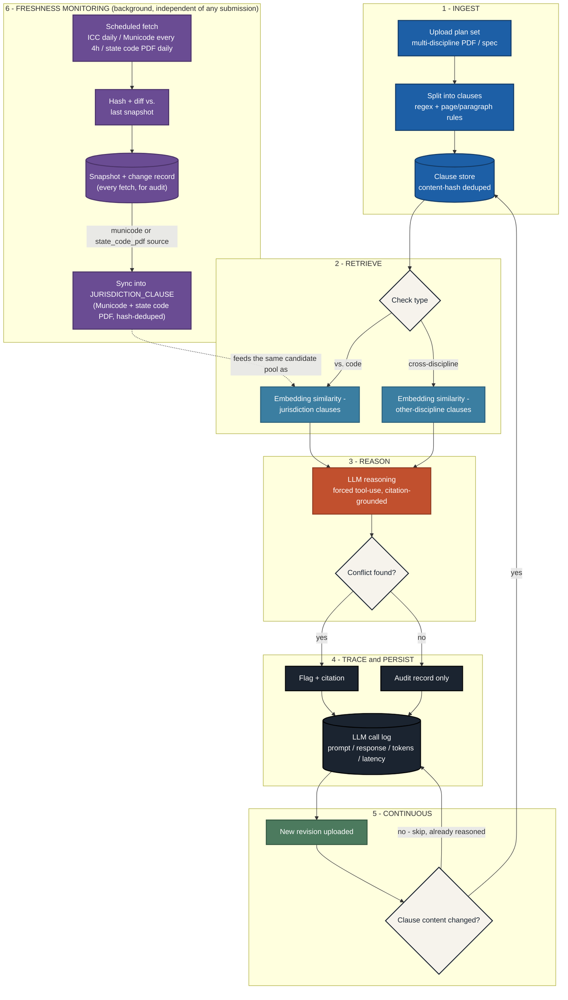

# Backend Workflow

Companion to [ERD.md](ERD.md) (the data model) — this is the *process* a
submission goes through, end to end. Five stages, with an explicit loop back
into stage 1 on a new revision, plus a sixth stage (freshness monitoring)
that runs independently in the background, not as part of any submission's
own path through stages 1-5.

## Stage notes

1. **Ingest** — a plan set is split into clauses, not fixed-token chunks (see
   ERD.md's `CLAUSE` notes): the retrieval unit is driven by what a citation
   needs to reference, not by convenience. Table noise is redacted before
   splitting (`app/clause_extraction.py`).
2. **Retrieve** — a local sentence-embedding model (`all-MiniLM-L6-v2`, via
   `sentence-transformers`, see `app/retrieval.py`) narrows candidates
   before the LLM runs, so the LLM
   never has to compare every clause against every other clause (O(n²)).
   Which candidate pool it searches depends on check type: jurisdiction code
   clauses (`find_candidate_jurisdiction_clauses`) or other-discipline
   project clauses in the same submission
   (`find_candidate_cross_discipline_clauses`).
3. **Reason** — forced tool-use constrains the model to a JSON schema so it
   can only cite clause IDs it was actually shown (`app/llm.py`,
   `app/llm_groq.py`; `app/llm_mock.py` is a labeled placeholder, never
   mistaken for real reasoning). Citations to anything outside what was
   shown are dropped before persistence, as defense in depth.
4. **Trace & persist** — every clause actually reasoned over gets an
   `LLM_CALL` row, whether or not it produced a flag (`app/check_persistence.py`).
   A `Flag` always traces back to exactly one `LLM_CALL`. A flag also carries
   a reviewer disposition (`Flag.status` - open/acknowledged/resolved/false
   positive, set from the flags page), independent of this pipeline; see
   ERD.md.
5. **Continuous** — `Clause` rows are immutable and content-hash deduped, so
   a clause only ever needs reasoning once per check type, ever. A new
   revision only triggers reasoning on genuinely new/changed clauses
   (incremental by default; `force=True` clears and redoes everything).
   Revision diffing (`diff_between_submissions`) and audit export
   (`/projects/<id>/audit-report`, `.csv`) both build on this same
   content-hash identity.
6. **Freshness monitoring** — a separate background loop (`app/freshness/`),
   not triggered by any submission or check: a scheduler thread polls each
   configured source (ICC's edition sitemap daily, a Municode jurisdiction's
   ordinance chapter every 4h, a state-published code PDF daily) and always
   records a snapshot, writing a change record only when the fetch's content
   hash actually differs from the last one. For a Municode or state-code-PDF
   source specifically, that fetch is also synced into `JURISDICTION_CLAUSE`
   (hash-deduped, so unchanged sections don't create duplicate rows) —
   feeding the *same* candidate pool stage 2's "vs. code" retrieval searches,
   not just a separate dashboard. This matters beyond convenience: a
   jurisdiction's Municode ordinance is usually just its *local amendments*
   ("adopts the 2021 IBC, changes sections X and Y") - without the base code
   text too, retrieval has nothing to find for the other 95% of provisions
   nobody locally amended, so a real violation there would go undetected not
   because the LLM reasoned wrong, but because it was never shown anything
   relevant (see app/llm.py's citation-grounding - the model can only cite
   clause_ids it was actually shown, never its own training-data knowledge of
   what a code "generally" says). The state code PDF closes that gap wherever
   a state publishes one for free (confirmed for CT/RI/NJ; not every state
   does - e.g. Pennsylvania has no free full-text equivalent).
   ICC sources aren't synced into any clause pool - an edition-year signal
   isn't clause text to reason over, just a coarse "has the base code
   revved" indicator. Public/unofficial sources only for ICC/Municode (POC
   scope); state code PDFs are genuine official public-record documents. See
   `app/freshness/icc.py`, `app/freshness/municode.py`, and
   `app/freshness/state_code.py` for source-specific caveats.

## Presentation version

A styled, presentation-ready version of this diagram (with stage
walkthroughs, the two-check-type comparison, and the trust/traceability
callouts) is published as a standalone page for demo use - ask before
regenerating, since it's hand-designed rather than derived from this file.
